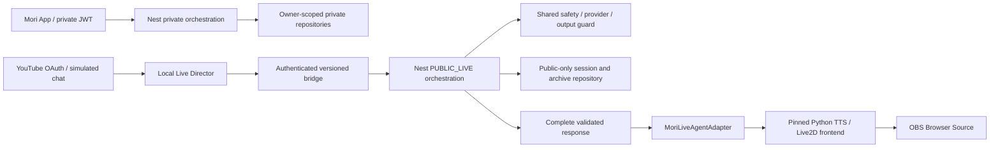

# Mori Live architecture decision — ADR 001

Date: 2026-10-11. Status: integration strategy accepted for implementation;
Milestone A is a transport foundation, not a broadcast-ready product.

## Boundaries

The backend remains the only AI authority. Never send partial provider tokens to
TTS before output review finishes. `PUBLIC_LIVE` is a distinct principal and data
access boundary, not a mobile user with a special prompt. Its module must not
inject `DatabaseService`, `MemoriesService`, or the private orchestrator. Empty
public memory is the initial policy. Later retrieval uses a public-only repository.
Only shared provider, safety, intent and output-review components may be reused.
The existing private pipeline and API authentication remain unchanged in A.

## Actual Mori audit

Baseline: `1b2929e`, branch `experiment/live2d-snow-neko`.

- `apps/api/src/app.module.ts`: modular Nest monolith, global Supabase `AuthGuard`
  and `ThrottlerGuard` (90 requests/minute). A desktop token cannot simply reuse a
  private JWT. B needs its own narrowly scoped authentication boundary.
- `modules/ai/orchestrator.service.ts`: normalize, safety, intent, approved memory,
  prompt, provider, output guard, persistence. Private sessions use bounded supplied
  history without memory retrieval. Preserve both methods.
- `modules/safety/safety.service.ts`: lexical + independent structured classifier;
  unavailable classification and elevated/crisis bypass normal generation.
- `ai/guards/output.guard.ts`: lexical checks and independent reviewer, fail closed.
  Mock providers skip model classification/review; mock is not safety certification.
- `ai/providers/provider.ts`: text/structured/embedding abstraction; HTTP adapter
  has bounded timeouts and typed errors. Future local models belong here.
- `database/database.service.ts`: service-role client with owner-scoped helpers.
  Because that credential can bypass RLS, do not inject it into the live repository.
- `modules/memories/memories.service.ts`: embeddings and `match_memories(p_user)`;
  expressly excluded from public execution. Journals, goals, letters, milestones,
  private conversations and account export remain private.
- `supabase/migrations`: owner RLS, server-only writes/RPCs, memory provenance,
  account cascades, private-save idempotency and server-only safety events.
- `apps/mobile`: Expo Router, SecureStore native auth, owner-namespaced drafts,
  explicit demo mode. Existing Snow Neko WebView feature is experimental and stays
  independent of the desktop runtime.
- `packages/shared`: existing domain Zod schemas. New wire contracts belong in
  `packages/live-protocol` to avoid pulling private domain models into runtime code.
- Tests cover safety, orchestration, auth, memory, privacy, provider errors, personal
  world features and mobile interactions. Use actual root scripts for regression.

## Upstream audit and pin

Sources: [runtime](https://github.com/Open-LLM-VTuber/Open-LLM-VTuber/tree/3afa41014b4548a0842e9ee2f576f4b164b48886),
[frontend](https://github.com/Open-LLM-VTuber/Open-LLM-VTuber-Web/tree/06a659b114fff788cf0daaa86e484576db4975bf).
GitHub latest release at audit: v1.2.1 (2025-08-26). Main HEAD observed:
`992309c0aa19845960228f880013d4685fde93b5`; do not follow main automatically.
Runtime release commit: `3afa41014b4548a0842e9ee2f576f4b164b48886`.
Frontend gitlink: `06a659b114fff788cf0daaa86e484576db4975bf` (build branch).
`uv.lock` SHA256: `13f0c3b7de0d6fd0992ba01ed57f76b53c3bdb865e6b74f065d0bea818a1e15b`.

`pyproject.toml` and `uv.lock` require Python >=3.10,<3.13. Select Python 3.11
for Windows setup. Upstream dependencies include Torch, ONNX, NumPy <2, FastAPI,
HTTPX and cloud TTS SDKs; full installation is considerably larger than the mock
bridge. Use `uv sync --frozen`, never regenerate the upstream lock casually.

### Reuse / extend / avoid

| Component | Decision and inspected behavior |
| --- | --- |
| `agent/agents/agent_interface.py` | Implement `chat(BaseInput)` async iterator, `handle_interrupt`, `set_memory_from_history`; emit `SentenceOutput(DisplayText, tts_text, Actions)` only after backend validation. History loader must never load Mori private history. |
| `agent/agent_factory.py` | Hard-coded choices, no general plugin registration. Use a minimal pinned launcher/factory extension in C; fail on unexpected version. No invented plugin configuration. |
| `agent/input_types.py` | `BatchInput.texts`, optional images/files/metadata. Initially accept text only; reject unsupported media and proactive speech. |
| `agent/output_types.py` | `Actions` allows expressions/pictures/sounds. Mori exposes only allowlisted expression IDs; no arbitrary picture/sound URLs or commands. |
| `conversations/tts_manager.py` | Ordered delivery with parallel synthesis. Requires explicit cancellation and playback acknowledgement tests: `clear()` alone does not cancel all synthesis tasks. |
| `utils/stream_audio.py` | WAV/base64 `audio`, `volumes`, `slice_length` (20ms), `display_text`, `actions`; zero-volume input currently errors. Validate silence handling before mock audio reuse. |
| `live2d_model.py` / `model_dict.json` | Model manifest path plus `emotionMap`; map verified expression names, not generated tags. |
| `routes.py`, `server.py` | `/client-ws` accepts without auth; wildcard CORS and static mounts. Do not launch unmodified for public/operator use. Require exact Host/Origin, local binding, auth and route allowlist. |
| `websocket_handler.py` | `text-input`, `interrupt-signal`, `audio-play-start`, heartbeat; also history/config switching, mic and proactive triggers. Disable unnecessary routes/operations. |
| `conversations/single_conversation.py` | Logs raw user/AI text and writes local history. Avoid this handler or patch logging/history before C; it cannot be used unchanged. |
| Frontend pinned build | Bundled frontend and Cubism Core files inspected; audio/interrupt events present. Build artifact is not a maintainable source checkout. Inspect matching source before frontend modification; old Core compatibility with supplied MOC is not established. |
| `live/bilibili_live.py` | Platform-specific implementation; not a YouTube adapter. Implement official YouTube OAuth separately in F. |
| Agent memory / MCP / tools / LLM factory | Do not use: creates a second AI authority, tool execution and independent memory. |

No upstream test files were found by tracked-file enumeration in this release.
Upstream pre-commit pins Ruff 0.9.6. Python adapter tests and lint must be separate
from TypeScript checks when Python implementation begins.

### Licensing and model evidence

Runtime code is MIT; retain notices on redistribution. `LICENSE-Live2D.md` has
separate sample-model terms; bundled Cubism binaries, frontend libraries, voices,
model weights and purchased avatars are not automatically covered by runtime MIT.
This is an inventory, not clearance to redistribute or train on any of them.
Keep checkout, caches, tokens and model files outside tracked source.

Local supplied directory `C:/Users/hantu/.codex/mori` contains SDK 5-r.5 and
`snow-neko-live2d-assets`, not a separately identified Fluffy Wintery Kitty package.
Existing validation records model3 manifest v3, one 10MB MOC, four 4096px textures,
33 expressions, physics, idle motion and `ParamMouthOpenY`; lip-sync group empty.
Manifest version 3 is not proof of binary Cubism/Core compatibility. Existing
official Core rendering passed previously; upstream's older bundled Core remains
unverified. Confirm target asset identity and usage rights before model delivery.
The inspected local model README says it was derived from the user's Snow Neko
ZIP and that expression/motion references were added locally; it is not a license
grant. Manifest contents were rechecked in this audit without copying assets.

## Protocol and security decisions

Versioned strict Zod objects; UUID session/turn/request/event IDs. Server assigns
session; authentication cannot select another principal. Request ID is per network
attempt; event/turn IDs persist across retries. Duplicate turns return the same
response event; changed payload for an existing turn is conflict. Replay cache is
bounded and session-scoped. Consumers deduplicate response event IDs before speech.
Session expiry/restart requires an explicit new session, never silent replay.

Milestone A uses a deterministic authenticated HTTP mock fixture on 127.0.0.1.
It never calls an LLM, Supabase or upstream and always labels output `MOCK`.
It is not the future public API and is not a second AI brain. No viewer input is
reflected in canned responses. Production/staging modes fail closed in this fixture.
No browser access or WebSocket is exposed in A; reject all Origin headers, validate
Host, bound body size, request count, replay memory and timeouts. Authentication
secrets stay in environment variables. Logs contain only lifecycle metadata.

In B the public Nest orchestration must own sessions, auth, quota/cost reservation,
safety, public context and persistence. Live auth must not grant private routes.
In C the Python adapter must propagate cancellation and validate backend contracts.
No automatic retry for ambiguous operations; replay only the same idempotent turn.
Stop must invalidate pending generation/playback before any new speech can begin.

## Milestone gates

A: documented audit + exact pins + isolated workspace + executable authenticated
mock roundtrip, invalid/auth/replay/cancel tests, regression checks.

B: public Nest pipeline and dedicated principal, repository isolation tests,
classifier/output-review failure tests, quotas, budget and timeout tests.

C: actual pinned AgentInterface adapter + secured launcher + mock/real avatar;
verify Python separately, remove raw upstream logs and history access.

D: Vietnamese configurable TTS, queue, cancellation, playback-driven gated/smoothed
RMS mouth motion; test silence, interruption, errors and reconnect.

E: transparent browser renderer; manual OBS scene/audio capture validation.

F: official YouTube OAuth, poll interval/quota handling, bounded selection queue,
dedup/cooldown and Director state machine. Proactive speech disabled. Facebook deferred.

G: operator dashboard and separate public archive. Raw records default prohibited
when rights are uncertain; otherwise pending_review. Explicit review + provenance,
redaction, retention, revocation/deletion and approved-only versioned JSONL export.
Generated output rights require provider-specific review; no automatic training.

Real OBS, OAuth, paid TTS, device and licensed-model checks cannot be substituted
with mock test results. Record verified and pending work in MORI_LIVE_STATUS.md.
